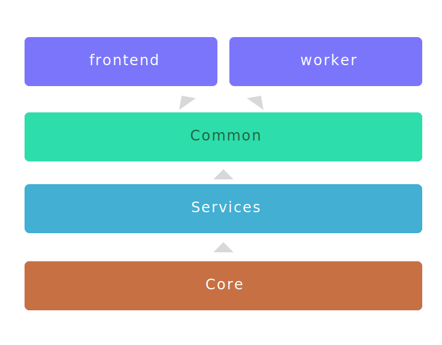

# Hangfire Framework - Sample

This is a framework for wrapping Hangfire with an opinionated syntax for
queueing jobs. It essentially draws inspiration from .NET MVC middleware
configuration with the following goals.

1. Encourage scalars when defining job options.
2. Use "convention over configuration" when queueing jobs.
3. Create abstractions to make testing easier.

## Usage

A job should be defined in a single class which is instantiated by the global
`IJobRunner`. By convention you should create a job options class, the job
handler class and an helper extension on the job runner.

While this sample application doesn't feature validation on `IJobOptions`, it is
recommended. Validation should take place on the job runner when a job is
scheduled.

```csharp
/**
 * Options will be serialized when scheduling the job.
 * They should be scalers or other values that serialize
 * easily.
 */
public class LongRunningJobOptions : IJobOptions
{
    public int TaskTime { get; set; } = 2;
}
    
/**
 * The Job class will be instantiated by the Worker process
 * and should have been configured with an IoC to simplify testing.
 */
public class LongRunningJob : IJob<LongRunningJobOptions>
{
    public void Perform(LongRunningJobOptions options)
    {
        Console.WriteLine("LongRunningTask: Started");

        var stopWatch = Stopwatch.StartNew();
        Thread.Sleep(TimeSpan.FromSeconds(options.TaskTime));
        
        Console.WriteLine($"LongRunningTask: Finished ({stopWatch.Elapsed})");
    }
}

/**
 * Adding a helper method on the +IJobRunner+ provides a
 * cleaner API when testing and reading through application
 * code.
 */
public static class LongRunningJobExtension
{
    public static void QueueLongRunningJob(this IJobRunner jobRunner, Action<LongRunningJobOptions> configureJob)
    {
        jobRunner.Queue<LongRunningJob, LongRunningJobOptions>(configureJob);
    }
}

/**
 * With the options class and helper method defined we
 * can queue a job with a simple api.
 */
public void Main(IJobRunner jobRunner)
{
    jobRunner.QueueLongRunningJob(options => { options.TaskTime = 10; });
}
```

## Demo


```bash
$ git clone https://github.com/BaylorRae/hangfire-framework-sample.git
$ cd hangfire-framework-sample

# build the frontend and worker projects
$ docker-compose build

# start everything as a daemon
$ docker-compose up -d

# follow the logs for frontend and worker1
$ docker-compose logs -f frontend worker1
```

## Project Structure

This project is designed to keep all 3rd party dependencies in the top most
layers (e.g. `frontend`, `worker` and `common`). This is accomplished by
wrapping all third party apis with internal interfaces in our `core` project.


